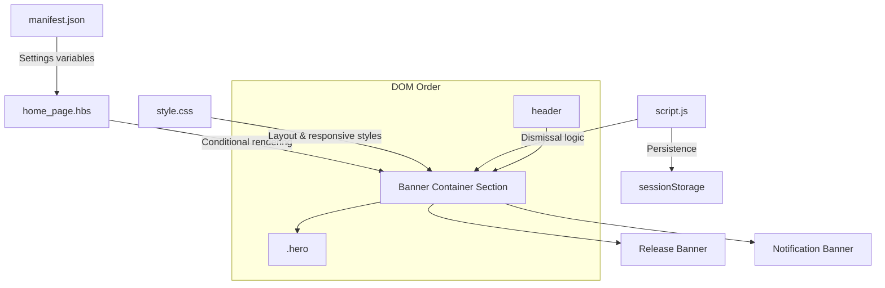
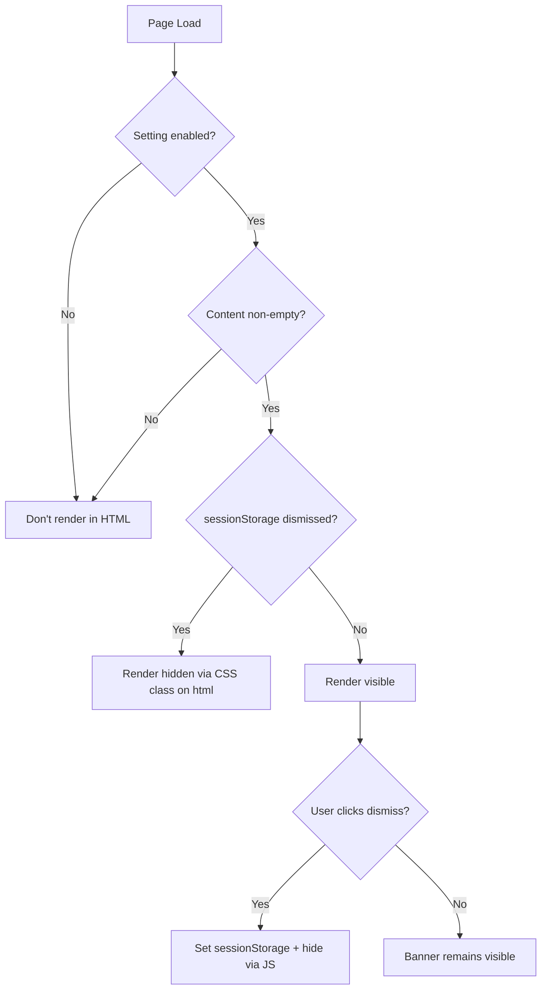

# Design Document: Banner Placement Layout

## Overview

This design defines the architecture and implementation approach for placing two configurable announcement banners (Release Banner and Notification Banner) between the existing header and hero section in the Hilti PROFIS Engineering Zendesk Help Center theme. The banners are rendered server-side via Handlebars conditionals, styled with CSS, and their dismissal behavior is managed with vanilla JavaScript and sessionStorage.

The implementation must:
- Render banners in the correct DOM position without modifying `header.hbs`
- Maintain zero Cumulative Layout Shift (CLS)
- Support independent enable/disable and dismissal per banner
- Operate fully within the Zendesk Guide theming constraints (Handlebars, single CSS file, single JS file, manifest.json settings)

## Architecture

The feature consists of three layers that integrate into the existing theme structure:



### Design Decisions

1. **Server-side rendering via Handlebars conditionals** — Banners are rendered inline in the HTML response, not injected by JavaScript. This eliminates CLS because the browser paints the banners in their final position on first contentful paint. The tradeoff is that dismissed banners require JavaScript to hide them early (before paint), handled by an inline `<script>` in `document_head.hbs` or a synchronous check at the top of the banner container.

2. **Placement in `home_page.hbs` only** — The banner section is inserted at the top of `home_page.hbs`, above the hero div. Since the page structure renders as `header.hbs` → `home_page.hbs` content → `footer.hbs`, and the header's closing `</header>` tag is at the end of `header.hbs`, the banner container naturally becomes the first element after the header in the rendered DOM. No modifications to `header.hbs` are required.

3. **CSS-only layout flow** — The banner container participates in normal document flow. When banners are hidden (via Handlebars conditional or JS dismissal), they contribute zero height. No absolute positioning or JavaScript-driven height calculations are needed.

4. **`sessionStorage` for dismiss persistence** — Chosen over `localStorage` because the requirement specifies per-tab-session persistence (dismissal resets when the tab is closed). Each banner gets its own storage key for independent state.

5. **Z-index below header** — The header uses `z-index: 96` (fixed) or `z-index: 97` (sticky). The banner container will use `z-index: 50`, ensuring the header always renders above banners during scroll overlap.

## Components and Interfaces

### 1. Theme Settings (manifest.json)

New settings added under a dedicated `"banner_group_label"` group:

| Identifier | Type | Default | Purpose |
|---|---|---|---|
| `release_banner_enabled` | checkbox | `false` | Toggle Release Banner visibility |
| `release_banner_content` | text | `""` | Release Banner message text |
| `release_banner_bg_color` | color | `#d2051e` | Release Banner background colour |
| `release_banner_text_color` | color | `#ffffff` | Release Banner text colour |
| `release_banner_icon` | list | `"none"` | Release Banner icon selection (none, info, warning, megaphone, rocket, custom) |
| `release_banner_custom_icon` | file | — | Release Banner custom icon upload (SVG/PNG) |
| `notification_banner_enabled` | checkbox | `false` | Toggle Notification Banner visibility |
| `notification_banner_content` | text | `""` | Notification Banner message text |
| `notification_banner_bg_color` | color | `#f5f5f4` | Notification Banner background colour |
| `notification_banner_text_color` | color | `#524f53` | Notification Banner text colour |
| `notification_banner_icon` | list | `"none"` | Notification Banner icon selection (none, info, warning, megaphone, rocket, custom) |
| `notification_banner_custom_icon` | file | — | Notification Banner custom icon upload (SVG/PNG) |

These settings are namespaced separately from the existing `notification_location` and `notification_content` settings to avoid interference.

### 2. Banner Container Template (home_page.hbs)

```handlebars
{{#if (or (and settings.release_banner_enabled settings.release_banner_content) 
          (and settings.notification_banner_enabled settings.notification_banner_content))}}
<section class="announcement-banners" aria-label="Announcements">
  {{#if settings.release_banner_enabled}}
    {{#if settings.release_banner_content}}
      <div class="announcement-banner announcement-banner--release" 
           data-banner-id="release" 
           role="alert">
        <div class="announcement-banner__content">
          {{settings.release_banner_content}}
        </div>
        <button class="announcement-banner__dismiss" 
                type="button" 
                aria-label="Dismiss release announcement"
                data-dismiss-banner="release">
          <svg xmlns="http://www.w3.org/2000/svg" viewBox="0 0 24 24" width="16" height="16" fill="currentColor" aria-hidden="true">
            <path d="M19 6.41L17.59 5 12 10.59 6.41 5 5 6.41 10.59 12 5 17.59 6.41 19 12 13.41 17.59 19 19 17.59 13.41 12z"/>
          </svg>
        </button>
      </div>
    {{/if}}
  {{/if}}
  {{#if settings.notification_banner_enabled}}
    {{#if settings.notification_banner_content}}
      <div class="announcement-banner announcement-banner--notification" 
           data-banner-id="notification" 
           role="alert">
        <div class="announcement-banner__content">
          {{settings.notification_banner_content}}
        </div>
        <button class="announcement-banner__dismiss" 
                type="button" 
                aria-label="Dismiss notification announcement"
                data-dismiss-banner="notification">
          <svg xmlns="http://www.w3.org/2000/svg" viewBox="0 0 24 24" width="16" height="16" fill="currentColor" aria-hidden="true">
            <path d="M19 6.41L17.59 5 12 10.59 6.41 5 5 6.41 10.59 12 5 17.59 6.41 19 12 13.41 17.59 19 19 17.59 13.41 12z"/>
          </svg>
        </button>
      </div>
    {{/if}}
  {{/if}}
</section>
{{/if}}
```

### 3. Banner Dismissal Script (script.js)

```javascript
// Banner Dismissal Module
;(function() {
  'use strict';

  var STORAGE_PREFIX = 'hilti_banner_dismissed_';
  var pendingDismissals = [];
  var batchTimer = null;

  function isSessionDismissed(bannerId) {
    try {
      return sessionStorage.getItem(STORAGE_PREFIX + bannerId) === '1';
    } catch (e) {
      return false;
    }
  }

  function setSessionDismissed(bannerId) {
    try {
      sessionStorage.setItem(STORAGE_PREFIX + bannerId, '1');
    } catch (e) {
      // Graceful degradation: dismiss for current page view only
    }
  }

  function removeBannerFromFlow(bannerEl) {
    bannerEl.style.display = 'none';
    bannerEl.setAttribute('aria-hidden', 'true');
  }

  function cleanupContainer() {
    var container = document.querySelector('.announcement-banners');
    if (!container) return;
    var visibleBanners = container.querySelectorAll(
      '.announcement-banner:not([style*="display: none"])'
    );
    if (visibleBanners.length === 0) {
      container.style.display = 'none';
    }
  }

  function processBatchedDismissals() {
    pendingDismissals.forEach(function(bannerEl) {
      removeBannerFromFlow(bannerEl);
    });
    pendingDismissals = [];
    cleanupContainer();
  }

  function dismissBanner(bannerId) {
    setSessionDismissed(bannerId);
    var bannerEl = document.querySelector(
      '[data-banner-id="' + bannerId + '"]'
    );
    if (!bannerEl) return;

    pendingDismissals.push(bannerEl);
    
    if (batchTimer) cancelAnimationFrame(batchTimer);
    batchTimer = requestAnimationFrame(function() {
      processBatchedDismissals();
      batchTimer = null;
    });
  }

  function init() {
    // Hide previously dismissed banners before paint
    var banners = document.querySelectorAll('[data-banner-id]');
    banners.forEach(function(banner) {
      var id = banner.getAttribute('data-banner-id');
      if (isSessionDismissed(id)) {
        removeBannerFromFlow(banner);
      }
    });
    cleanupContainer();

    // Attach dismiss handlers
    document.addEventListener('click', function(e) {
      var btn = e.target.closest('[data-dismiss-banner]');
      if (!btn) return;
      var bannerId = btn.getAttribute('data-dismiss-banner');
      dismissBanner(bannerId);
    });
  }

  // Run as early as possible
  if (document.readyState === 'loading') {
    document.addEventListener('DOMContentLoaded', init, { once: true });
  } else {
    init();
  }
})();
```

### 4. Early Hide Script (document_head.hbs or inline)

To prevent flash of dismissed banners, a small inline script runs synchronously:

```html
<script>
(function() {
  try {
    var p = 'hilti_banner_dismissed_';
    var s = window.sessionStorage;
    if (s.getItem(p + 'release') === '1') {
      document.documentElement.classList.add('banner-release-dismissed');
    }
    if (s.getItem(p + 'notification') === '1') {
      document.documentElement.classList.add('banner-notification-dismissed');
    }
  } catch(e) {}
})();
</script>
```

With corresponding CSS:

```css
.banner-release-dismissed [data-banner-id="release"],
.banner-notification-dismissed [data-banner-id="notification"] {
  display: none !important;
}
```

### 5. CSS Styles (style.css)

```css
/* ============================================================
   ANNOUNCEMENT BANNERS
   ============================================================ */
.announcement-banners {
  position: relative;
  z-index: 50;
  width: 100%;
}

.announcement-banner {
  display: flex;
  align-items: center;
  justify-content: space-between;
  gap: 1rem;
  width: 100%;
  padding: 0.75rem 2rem;
  font-size: 0.875rem;
  line-height: 1.5;
}

.announcement-banner--release {
  background-color: #d2051e;
  color: #fff;
}

.announcement-banner--notification {
  background-color: #f5f5f4;
  color: #524f53;
  border-bottom: 1px solid #e0e0e0;
}

.announcement-banner__content {
  flex: 1;
  max-width: 1280px;
  margin: 0 auto;
}

.announcement-banner__dismiss {
  flex-shrink: 0;
  display: inline-flex;
  align-items: center;
  justify-content: center;
  width: 28px;
  height: 28px;
  padding: 0;
  border: none;
  background: transparent;
  color: inherit;
  cursor: pointer;
  border-radius: 4px;
  opacity: 0.8;
  transition: opacity 0.15s ease;
}

.announcement-banner__dismiss:hover,
.announcement-banner__dismiss:focus-visible {
  opacity: 1;
  outline: 2px solid currentColor;
  outline-offset: 2px;
}

/* Responsive: constrain content at large viewports */
@media (min-width: 992px) {
  .announcement-banner__content {
    max-width: 1280px;
  }
}

/* Responsive: mobile adjustments */
@media (max-width: 767px) {
  .announcement-banner {
    padding: 0.75rem 2rem;
    flex-wrap: wrap;
  }
  
  .announcement-banner__content {
    word-wrap: break-word;
    overflow-wrap: break-word;
  }
}
```

## Data Models

This feature does not introduce persistent data models. The state is managed through:

### Theme Settings (manifest.json variables)

```json
{
  "release_banner_enabled": boolean,
  "release_banner_content": string,
  "notification_banner_enabled": boolean,
  "notification_banner_content": string
}
```

### Session State (sessionStorage)

| Key | Type | Values | Lifetime |
|---|---|---|---|
| `hilti_banner_dismissed_release` | string | `"1"` or absent | Tab session |
| `hilti_banner_dismissed_notification` | string | `"1"` or absent | Tab session |

### Banner Visibility Decision Logic



## Correctness Properties

*A property is a characteristic or behavior that should hold true across all valid executions of a system — essentially, a formal statement about what the system should do. Properties serve as the bridge between human-readable specifications and machine-verifiable correctness guarantees.*

### Property 1: Dismissal session persistence round-trip

*For any* banner (release or notification) with any non-empty content string, if a user dismisses the banner, then on any subsequent simulated page load within the same sessionStorage context, that banner should not be visible (display: none) while the other banner's visibility remains unchanged.

**Validates: Requirements 5.1, 5.2, 5.6**

### Property 2: Dismissal independence — remaining elements unaffected

*For any* pair of banner content strings where both banners are enabled, dismissing one banner should not alter the computed width, computed height, or display property of the remaining visible banner or the header element.

**Validates: Requirements 5.3, 5.6**

### Property 3: Layout offset equals combined banner height

*For any* combination of banner content strings (including when one or both are enabled), the vertical offset between the bottom of the header and the top of the hero section should equal the sum of rendered heights of all visible banners.

**Validates: Requirements 4.1**

### Property 4: No horizontal overflow at any supported viewport width

*For any* viewport width ≥ 320px and any banner content string up to 500 characters, the document body should have no horizontal scrollbar (document.body.scrollWidth ≤ document.body.clientWidth).

**Validates: Requirements 7.1, 7.5**

## Error Handling

| Scenario | Handling Strategy |
|---|---|
| `sessionStorage` unavailable (private browsing, storage full) | Dismiss still removes banner from DOM for current page view; wrap all storage access in try/catch |
| Banner content contains HTML entities or special characters | Handlebars auto-escapes `{{settings.x}}` by default, preventing XSS |
| Both banners dismissed simultaneously (rapid clicks) | `requestAnimationFrame` batching ensures single DOM reflow |
| Settings variable undefined or missing | Handlebars `{{#if}}` evaluates undefined/null/empty-string as falsy — banner won't render |
| CSS not loaded (broken stylesheet) | Banners degrade to unstyled block elements in document flow; layout still functions |
| JavaScript not loaded or fails | Banners render and remain visible but dismiss buttons won't function; no broken state |

## Testing Strategy

### Unit Tests (Example-Based)

These verify specific scenarios and edge cases:

1. **Template rendering tests** — Verify DOM structure for all four setting combinations (both enabled, only release, only notification, both disabled)
2. **Stacking order** — Verify Release Banner is always first child, Notification Banner second
3. **Empty content gate** — Verify enabled toggle + empty content = no rendering
4. **Z-index values** — Verify banner container z-index (50) < header z-index (96/97)
5. **Responsive breakpoint styles** — Verify padding and max-width at specific viewport widths
6. **SessionStorage unavailability** — Mock sessionStorage to throw, verify dismiss still works for current view
7. **Non-interference** — Compare header/hero computed styles with and without banners
8. **Existing notification compatibility** — Verify `notification_location` + `notification_content` still work alongside new banner settings

### Property-Based Tests

Property-based testing is applicable here for the JavaScript dismissal logic and layout computation, which have clear input/output behavior across a range of inputs.

**Library:** fast-check (JavaScript property-based testing library)

**Configuration:**
- Minimum 100 iterations per property test
- Each test tagged with: **Feature: banner-placement-layout, Property {N}: {description}**

**Properties to implement:**
1. Dismissal session persistence round-trip (Property 1)
2. Dismissal independence (Property 2)
3. Layout offset = sum of banner heights (Property 3)
4. No horizontal overflow at any viewport (Property 4)

### Integration Tests

- Full page render with Zendesk theme preview to validate CLS = 0
- Cross-browser verification (Chrome, Firefox, Safari) for sessionStorage behavior
- Mobile device testing at 320px, 375px, 768px, 992px, 1280px viewports

### Manual Verification

- Visual inspection of banner placement in Zendesk Guide theme preview
- Accessibility audit: keyboard navigation to dismiss buttons, screen reader announcements (role="alert")
- Performance: verify no layout shift using Chrome DevTools Performance panel
