# Hilti PE Knowledge Center — Zendesk Theme Documentation

> **Single source of truth** for the `fps_zd_skc_pe` repository.
> Structured with Confluence page markers (`<!-- CONFLUENCE PAGE: ... -->`) — each major section can be copy-pasted as a standalone Confluence page.
> The Table of Contents serves as the **parent page** linking to all child pages.
>
> **Diagrams:** This document uses [Mermaid](https://mermaid.js.org/) diagrams (fenced `mermaid` code blocks). They render natively in GitLab, Confluence (with the Mermaid macro), and VS Code (with a Mermaid preview extension). If a diagram shows as raw text, your viewer lacks a Mermaid renderer.

---

> ### 📣 What's New (version `0.19.69`)
>
> If you are onboarding, read this box first — it is the fast map of the most recent round of theme work (the **theme performance & security hardening** effort plus the Figma visual alignment pass). Each item links to its full section.
>
> | Area | Change | Section |
> |---|---|---|
> | 🖼️ Lightbox | Fancybox + jQuery replaced with a **native, zero-dependency** image lightbox | [§27](#27-feature-native-image-lightbox-no-jquery) |
> | 🔒 Security | **Subresource Integrity (SRI)** on every CDN `<script>`/`<link>`; combined jsDelivr bundle split into individually-hashed tags | [§28](#28-security-subresource-integrity-sri-on-cdn-assets) |
> | ⚡ Performance | Autocomplete panel positioning now **rAF-throttled**; jQuery removed from `<head>` (loads deferred, only when needed) | [§29](#29-performance-hardening) |
> | 🎨 Styling | `!important` reduced to **<20 non-utility** declarations; cascade-based overrides | [§29](#29-performance-hardening) |
> | 🔄 Page load | Consolidated **spinner + progress bar**, bfcache-safe, lightbox-safe (no stuck loader) | [§30](#30-feature-page-load-indicator-spinner--progress-bar) |
> | 📐 Layout | Header/body/footer aligned to the **Figma 1520px content column**, 16px title gaps, section columns | [§31](#31-figma-visual-alignment) |
> | 🔍 Search | Matched terms rendered **red-bold + yellow highlight** | [§31](#31-figma-visual-alignment) |

---

<!-- CONFLUENCE PAGE: Table of Contents (Parent Page) -->

## Table of Contents

| # | Page | Purpose |
|---|------|---------|
| 1 | [Project Overview](#1-project-overview) | What this repo is, what it owns, what it does not own |
| 2 | [Architecture](#2-architecture) | Runtime model, CI/CD model, tech stack |
| 3 | [Quick Start](#3-quick-start-for-new-team-members) | Day-one checklist |
| 4 | [Development Environment Setup](#4-development-environment-setup) | Tools, installation, authentication |
| 5 | [Local Preview Workflow](#5-local-preview-workflow) | How to preview changes before pushing |
| 6 | [Repository Structure](#6-repository-structure) | Every folder and file explained |
| 7 | [Template Reference](#7-template-reference) | What each Handlebars template renders |
| 8 | [Script.js Feature Map](#8-scriptjs-feature-map) | All JS features and how they work |
| 9 | [Style.css Architecture](#9-stylecss-architecture) | CSS organization and naming |
| 10 | [Admin Settings Reference](#10-admin-settings-reference) | All manifest.json settings |
| 11 | [Feature: Page Loading Bar](#11-feature-page-loading-progress-bar) | Red top-bar on load |
| 12 | [Feature: Announcement Banners](#12-feature-announcement-banners) | Dismissible banners |
| 13 | [Feature: Language Selector](#13-feature-language-selector) | Country/language modal |
| 14 | [Feature: Custom Autocomplete](#14-feature-custom-autocomplete-search) | Search enhancement |
| 15 | [Feature: Back-to-Top Button](#15-feature-back-to-top-button) | Draggable scroll button |
| 16 | [Feature: Auto-Fingerprint Refresh](#16-feature-auto-fingerprint-refresh) | Settings auto-reload |
| 17 | [Feature: Browser Language Redirect](#17-feature-browser-language-auto-redirect) | Locale detection |
| 18 | [Feature: View More/Less Toggle](#18-feature-view-moreless-toggle) | Expandable lists |
| 19 | [Feature: Category Icon Mapping](#19-feature-category-icon-mapping) | Dynamic icons |
| 20 | [Feature: Search Results Page](#20-feature-search-results-page) | Redesigned search |
| 21 | [Branching and Workflow](#21-branching-commits-and-workflow) | Daily dev process |
| 22 | [Versioning and Release](#22-versioning-and-release) | Semver automation |
| 23 | [Deployment Runbook](#23-deployment-runbook) | Deploy and rollback |
| 24 | [Testing](#24-testing) | Property-based tests |
| 25 | [Troubleshooting](#25-troubleshooting) | Common issues |
| 26 | [Governance](#26-governance-and-handover-boundaries) | Repo boundaries |
| 27 | [Feature: Native Image Lightbox](#27-feature-native-image-lightbox-no-jquery) | 🆕 No-jQuery lightbox |
| 28 | [Security: Subresource Integrity](#28-security-subresource-integrity-sri-on-cdn-assets) | 🆕 SRI on CDN assets |
| 29 | [Performance Hardening](#29-performance-hardening) | 🆕 rAF throttle, jQuery removal, CSS cleanup |
| 30 | [Feature: Page Load Indicator](#30-feature-page-load-indicator-spinner--progress-bar) | 🆕 Spinner + progress bar |
| 31 | [Figma Visual Alignment](#31-figma-visual-alignment) | 🆕 Layout + search highlight |
| 32 | [System Flow Diagrams](#32-system-flow-diagrams) | 🆕 Visual reference for all connects |

---

<!-- CONFLUENCE PAGE: 1. Project Overview -->

## 1. Project Overview

### What is this project?

This repository contains the **Zendesk Help Center custom theme** for the **Hilti PROFIS Engineering Software Knowledge Center** (PE SKC). It powers the customer-facing help site at `help.profisengineering.hilti.com`.

### What the theme controls

- Visual appearance of all Help Center pages (home, categories, sections, articles, search, community, requests)
- Client-side behavior (search autocomplete, language switching, banners, navigation)
- Admin-configurable settings (colors, layout, toggles) via Zendesk Theme Editor
- CI/CD pipeline for shipping theme changes to production

### What is NOT in this repository

| Out of scope | Where it lives |
|---|---|
| Help Center article content | Zendesk Guide CMS |
| Cross-repo release orchestration | External pipelines |
| Jira ticket automation | External tooling |
| Confluence release reports | External pipelines |
| User authentication/SSO | Zendesk/Identity provider |

### Key facts

| Property | Value |
|---|---|
| Theme name | Hilti [SKC] - PE Theme 2026 |
| Current version | `manifest.json` line 4 |
| Zendesk API version | 3 |
| Default locale | `en-us` |
| GitLab project | `bu-f-ps/sw-support-group/fps_zd_skc_pe` |
| Author/Maintainer | Zenplates / Kalidas Janardhanan |

---

<!-- CONFLUENCE PAGE: 2. Architecture -->

## 2. Architecture

### Runtime model

Zendesk renders pages **server-side** using Handlebars templates. There is no local web server.

- `manifest.json` + `templates/*.hbs` + `translations/*.json` → Zendesk Rendering Engine → HTML
- `style.css` → `<link rel="stylesheet">`
- `script.js` → `<script src="...">`
- `assets/*` → CDN URLs via `{{asset 'filename'}}`

#### How the pieces connect (render pipeline)

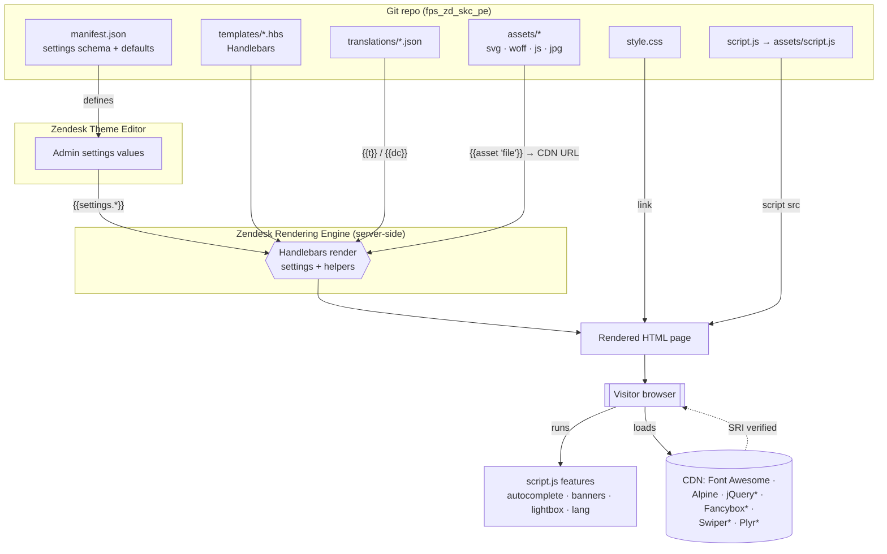

> `*` = conditional CDN resources, loaded only when the matching setting is enabled. See [§28](#28-security-subresource-integrity-sri-on-cdn-assets).

### Tech stack

| Layer | Technology |
|---|---|
| Templating | Handlebars (Zendesk Guide flavor) |
| Styling | Plain CSS (~21,000 lines, no preprocessor) |
| JavaScript | Vanilla ES5 IIFEs, no bundler |
| Fonts | Hilti brand (self-hosted .woff via assets) |
| External deps | Font Awesome 6.4.0, Alpine.js 3.13.0 (always) · jQuery 3.6.0, Fancybox 3.5.7, Swiper 7.0.9 (only with `promoted_video_ids`) · Plyr 3.6.4 (only with `enable_video_player`) |
| Lightbox | **Native, zero-dependency** JS lightbox (`assets/extension-lightboxes.js`) — replaced Fancybox/jQuery |
| CDN integrity | **SRI (SHA-384) + `crossorigin="anonymous"`** on every external script/style |
| Testing | Node.js test runner + fast-check + jsdom |
| CI/CD | GitLab CI + zcli (Zendesk CLI) |

> **Important dependency change:** jQuery is **no longer loaded in `<head>`** and is no longer a render-blocking resource. It ships `defer` in the footer **only** when `promoted_video_ids` is set (the single remaining jQuery consumer — the promoted-video Fancybox overlay). The image lightbox needs no jQuery. See [§27](#27-feature-native-image-lightbox-no-jquery) and [§29](#29-performance-hardening).

### CI/CD pipeline

```
Stages: release → backup → deploy

Default branch:  theme_version_release → theme_backup_production → theme_deploy_production
                                                                  → theme_rollback_production
Feature branches: theme_deploy_branch (preview)
```

All production jobs require manual trigger + confirmation variables.

---

<!-- CONFLUENCE PAGE: 3. Quick Start for New Team Members -->

## 3. Quick Start for New Team Members

| Step | Action | Verification |
|---|---|---|
| 1 | Get GitLab repository access | Can clone the repo |
| 2 | Get Zendesk Help Center admin access | Can see Theme Editor at `/hc/admin` |
| 3 | Install Git, Node.js (LTS), npm | `git --version`, `node --version` |
| 4 | Install Zendesk CLI | `zcli --version` |
| 5 | Clone repo and `npm ci` | Dependencies installed |
| 6 | Authenticate zcli | `zcli themes:list` shows themes |
| 7 | Run `zcli themes:preview` | Preview URL loads in browser |
| 8 | Create a branch, tweak CSS | Preview reflects change |
| 9 | Open merge request | Pipeline runs |

**Estimated time:** 30–60 minutes.

---

<!-- CONFLUENCE PAGE: 4. Development Environment Setup -->

## 4. Development Environment Setup

### Prerequisites

| Tool | Version | Purpose |
|---|---|---|
| Git | Latest | Version control |
| Node.js | LTS (20+) | Tooling runtime |
| npm | Bundled | Dependency management |
| zcli | 1.0.0-beta.56 | Theme preview/deploy |
| VS Code | Recommended | IDE |

### Installation steps

```bash
# 1. Clone
git clone git@ssh-git.hilti.com:7999/bu-f-ps/sw-support-group/fps_zd_skc_pe.git
cd fps_zd_skc_pe

# 2. Node.js (macOS)
brew install node

# 3. Zendesk CLI
npm install -g @zendesk/zcli

# 4. Authenticate
zcli login -i
# Subdomain: hiltiprofisengineering
# Email: your.email@hilti.com
# API Token: (from Zendesk Admin → API → Tokens)

# 5. Project dependencies
npm ci
```

No build step needed — theme uses plain CSS and vanilla JS.

---

<!-- CONFLUENCE PAGE: 5. Local Preview Workflow -->

## 5. Local Preview Workflow

### How it works

zcli uploads your local files to Zendesk's servers → provides preview URL → renders remotely with real Help Center data.

```bash
zcli themes:preview
# → Uploading theme... Ok
# → Preview: http://hiltiprofisengineering.zendesk.com/hc/admin/local_preview/start
```

Changes auto-upload on file save. Stop with `Ctrl+C`.

### Key points

- Preview is **remote** (not a local server) — needs internet
- Git push ≠ deploy — pushing doesn't deploy to Zendesk
- One preview session at a time per account
- If custom domain doesn't load, use `.zendesk.com` URL

---

<!-- CONFLUENCE PAGE: 6. Repository Structure -->

## 6. Repository Structure

```
fps_zd_skc_pe/
├── manifest.json              # Theme settings schema and defaults
├── script.js                  # Main client-side JavaScript
├── style.css                  # All styles (~21,000 lines)
├── package.json               # npm scripts (version/deploy/test)
├── .gitlab-ci.yml             # CI/CD pipeline
├── templates/                 # Handlebars page templates (20 files)
│   ├── document_head.hbs      #   <head>: meta, fonts, loading bar, consent, icons
│   ├── header.hbs             #   Nav, logo, search, language modal
│   ├── footer.hbs             #   Footer, social links, back-to-top
│   ├── home_page.hbs          #   Banners, hero, categories, blocks
│   ├── article_page.hbs       #   3-col layout, ToC, voting, sharing
│   ├── category_page.hbs      #   Category with sections
│   ├── section_page.hbs       #   Section with articles
│   ├── search_results.hbs     #   Search with filters + autocomplete
│   └── ...                    #   error, request, community pages
├── assets/                    # Static files (115 items, code-managed)
│   ├── *.svg (62)             #   Icons
│   ├── *.js (34)              #   Extension scripts (minified)
│   ├── *.woff (4)             #   Hilti brand fonts
│   ├── *.jpg (6)              #   Hero/background images
│   ├── fingerprint.js         #   Hash functions (used by tests)
│   └── script.js              #   COPY of root script.js
├── settings/                  # Admin-uploadable (favicon.png, logo.svg)
├── translations/              # Locale JSON files
├── tests/                     # Property-based tests (fast-check + jsdom)
└── tooling/
    ├── scripts/               # version, deploy, backup, rollback scripts
    └── config/                # brand-theme-map.json
```

### Critical rule: script.js duplication

`script.js` (root) and `assets/script.js` **must stay in sync**. Zendesk loads from `assets/`. Always copy after editing.

### What to change where

| Goal | File(s) |
|---|---|
| Page layout/structure | `templates/*.hbs` |
| Client-side behavior | `script.js` + `assets/script.js` |
| Colors, spacing, fonts | `style.css` |
| Admin settings | `manifest.json` |
| New image/icon | `assets/` + `{{asset 'filename'}}` in template |
| Deployment | `.gitlab-ci.yml` or `tooling/scripts/` |
| Translations | `translations/*.json` |

---

<!-- CONFLUENCE PAGE: 7. Template Reference -->

## 7. Template Reference

### Template-to-page mapping

| Template | URL pattern | Renders |
|---|---|---|
| `document_head.hbs` | All pages (`<head>`) | Meta, fonts, loading bar, consent, icon map, fingerprint |
| `header.hbs` | All pages (body top) | Nav, logo, tagline, search, language modal, user menu |
| `footer.hbs` | All pages (body bottom) | Footer, social, copyright, extension scripts, back-to-top |
| `home_page.hbs` | `/hc/{locale}` | Banners, hero + search, category blocks, custom blocks |
| `article_page.hbs` | `/hc/{locale}/articles/{id}` | Breadcrumbs, sidebar, article body, ToC, voting |
| `category_page.hbs` | `/hc/{locale}/categories/{id}` | Sections grid, sidebar |
| `section_page.hbs` | `/hc/{locale}/sections/{id}` | Article list, sidebar |
| `search_results.hbs` | `/hc/{locale}/search?query=...` | Search bar, filters, result cards |
| `new_request_page.hbs` | `/hc/{locale}/requests/new` | Support ticket form |
| `request_page.hbs` | `/hc/{locale}/requests/{id}` | Ticket detail |
| `requests_page.hbs` | `/hc/{locale}/requests` | Ticket list |
| `error_page.hbs` | Invalid URLs | Error message |
| Community templates (5) | `/hc/{locale}/community/...` | Topics, posts, new post |

### Render order

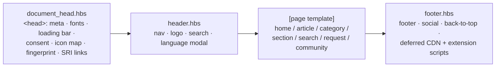

Every page is composed from the same three wrappers (`document_head`, `header`, `footer`) with exactly one page template slotted in the middle.

### Key Handlebars helpers

| Helper | Example |
|---|---|
| `{{settings.identifier}}` | `{{settings.hero_heading}}` |
| `{{asset 'file'}}` | `{{asset 'logo.svg'}}` → CDN URL |
| `{{t 'key'}}` | Translation string |
| `{{dc 'key'}}` | Dynamic Content (admin translations) |
| `{{#if ...}}` / `{{#is ... 'val'}}` / `{{#isnt ... 'val'}}` | Conditionals |
| `{{breadcrumbs}}`, `{{search}}`, `{{subscribe}}` | Built-in widgets |
| `{{help_center.url}}`, `{{help_center.locale}}` | Context vars |

---

<!-- CONFLUENCE PAGE: 8. Script.js Feature Map -->

## 8. Script.js Feature Map

`script.js` (~2400 lines) is organized as independent IIFEs. Each feature block can be read in isolation.

### Feature index

| # | Feature | Purpose | Trigger |
|---|---------|---------|---------|
| 1 | Custom Autocomplete | Search suggestions from API | `[data-custom-autocomplete]` |
| 2 | Small Helpers | Focus restore, template rendering, share popups | DOMContentLoaded |
| 3 | Category Icon Mapping | Replace default icons with SVG map | DOMContentLoaded |
| 4 | View More/Less | Collapse long lists (>8 items) | DOMContentLoaded + MutationObserver |
| 5 | New Request Page UX | Multi-select search, field grouping | DOMContentLoaded |
| 6 | Active Page Highlighting | Bold active category in sidebar | DOMContentLoaded |
| 7 | Article Sidebar Logic | Show only parent category sections | DOMContentLoaded |
| 8 | Global Empty State | Replace "empty" text with styled block | DOMContentLoaded |
| 9 | Category Sidebar Expand | First 5 items + expand toggle | DOMContentLoaded |
| 10 | Announcement Banners | Dismiss with fingerprint + sessionStorage | DOMContentLoaded |
| 11 | Language Switcher Modal | Country/language picker + API check | Click on trigger |
| 12 | Settings Fingerprint Refresh | Auto-reload on settings change | 60s interval |
| 13 | Search Results Enhancements | Filters, sorting, red-bold+yellow keyword highlight | DOMContentLoaded (search page) |

> **Autocomplete positioning is now rAF-throttled** (feature 1). Scroll/resize events coalesce into at most one `positionPanel()` layout read per animation frame, and the pending callback is cancelled when the panel hides. See [§29](#29-performance-hardening).

### Related assets (loaded separately, not in `script.js`)

| Asset | Purpose |
|---|---|
| `assets/extension-lightboxes.js` / `.min.js` | 🆕 Native no-jQuery image lightbox for `.content img` (self-contained IIFE). Gated on `enable_lightboxes`. See [§27](#27-feature-native-image-lightbox-no-jquery) |
| `assets/extension-video-library.min.js` | Promoted-video overlay (the only remaining jQuery/Fancybox consumer). Gated on `promoted_video_ids` |
| `templates/document_head.hbs` (inline) | Page-load spinner + progress bar. See [§30](#30-feature-page-load-indicator-spinner--progress-bar) |

### Conventions

- **ES5 syntax** — `var`, `function`, no arrow functions
- **IIFEs with `;`** — `;(function() { 'use strict'; ... })();`
- **No bundler/modules** — served as-is by Zendesk
- **Defensive DOM queries** — always check `if (!el) return`
- **After editing:** copy `script.js` → `assets/script.js`

---

<!-- CONFLUENCE PAGE: 9. Style.css Architecture -->

## 9. Style.css Architecture

Single file (~21,000 lines), no preprocessor, uses CSS custom properties.

### Design tokens

```css
:root {
  --color-primary: rgba(210, 5, 30, 1);      /* Hilti Red */
  --color-tertiary: rgba(171, 1, 21, 1);     /* Hilti Dark Red */
  --color-gray-100: rgba(248, 248, 247, 1);  /* Light BG */
  --color-gray-200: rgba(239, 235, 229, 1);  /* Borders */
  --font-heading: 'Hilti Small Bold', ...;
  --font-text: 'Hilti Small Roman', ...;
  --breakpoint-sm/md/lg/xl: 576/768/992/1200px;
}
```

### Major sections

| Section | Class prefix | Purpose |
|---|---|---|
| Reset | HTML elements | Browser normalization |
| Search | `.hc-autocomplete-*` | Custom autocomplete panel |
| Buttons | `.btn-*` | Primary/secondary/outline |
| Grid | `.container`, `.row`, `.col-*` | Layout |
| Banners | `.announcement-banner*` | Dismissible banners |
| Language Modal | `.hilti-lang-*` | Modal overlay + form |
| Article Page | `.article-*` | 3-col layout, ToC |
| Search Results | `.hc-search-*` | Filters, result cards |
| Footer | `.kc-footer`, `.footer-*` | Custom footer |
| Back-to-Top | `.article-back-to-top` | Floating button |
| Loading Bar | `.hilti-page-loading-bar` | Page load indicator |
| Responsive | `@media (max-width: ...)` | Mobile/tablet |

### Naming conventions

- BEM-like: `.announcement-banner__dismiss`
- Hilti-namespaced: `.hilti-lang-*`, `.hilti-page-loading-bar`
- Utilities: `.flex`, `.mt-6`, `.hidden`

---

<!-- CONFLUENCE PAGE: 10. Admin Settings Reference -->

## 10. Admin Settings Reference

Settings are defined in `manifest.json` → appear in Zendesk Admin → Theme Settings. Templates consume them as `{{settings.identifier}}`.

### Settings groups

| Group | Key settings | Consumed in |
|---|---|---|
| Brand | `favicon`, `logo`, `logo_height`, `tagline` | `header.hbs` |
| Search | `header_search_style`, `instant_search`, `scoped_kb_search`, `search_placeholder` | `header.hbs`, `search_results.hbs` |
| Header | `header_layout`, `fixed_header`, `sticky_header`, `nav_style`, `nav_breakpoint`, links 1-3 | `header.hbs` |
| Visibility | `show_submit_a_request_link`, `hide_sign_in_link`, `hide_article_downvote_cta` | `header.hbs`, `article_page.hbs` |
| General | `notification_location`, `back_to_top_link_style`, `boxed_layout` | Various |
| Banners | `release_banner_*` (enabled/icon/content/version/colors), `notification_banner_*` | `home_page.hbs` |
| Home Page | `hero_heading`, `popular_keywords`, `promoted_video_ids` | `home_page.hbs` |
| Custom Blocks | `custom_block_style`, blocks 1-4 (title/description/URL) | `home_page.hbs` |
| Article | `article_sidebar`, `show_article_voting/sharing/comments`, lightboxes, video player | `article_page.hbs` |
| Footer | `footer_shape`, social links, footer links | `footer.hbs` |
| Translations | `use_translations` (enables `{{dc ...}}`) | All templates |

### Adding a new setting

1. Add variable to appropriate group in `manifest.json`
2. Use in template: `{{settings.your_setting}}` or `{{#if settings.your_setting}}`
3. Preview to verify it appears in Theme Editor

---

<!-- CONFLUENCE PAGE: 11. Feature: Page Loading Progress Bar -->

## 11. Feature: Page Loading Progress Bar

### What it does

A 3px red bar at the viewport top animates during page load and on internal link clicks.

### How it works

1. `document_head.hbs` injects inline `<style>` + `<script>` early in `<head>`
2. Bar element created → class `is-animating` added → width animates to 85%
3. On `window.load` → class `is-complete` → fills to 100%, fades out, removed after 700ms
4. On internal link click → new bar instance created and animates before navigation

### Excluded links

- Hash links (`#anchor`)
- `javascript:` links
- `target="_blank"` links
- Modifier-key clicks (Ctrl/Cmd/Shift)

### CSS classes

| Class | Effect |
|---|---|
| `.hilti-page-loading-bar` | Fixed, top:0, 3px height, red, z-index:9999999 |
| `.is-animating` | width: 85% (1.2s cubic-bezier) |
| `.is-complete` | width: 100%, opacity: 0, fades out |

### Files

- `templates/document_head.hbs` (inline style + script)
- `style.css` (fallback rules)

---

<!-- CONFLUENCE PAGE: 12. Feature: Announcement Banners -->

## 12. Feature: Announcement Banners

### What it does

Two independently configurable, dismissible banners on the home page:
- **Release Banner** — product release announcements
- **Notification Banner** — general alerts

### Admin settings (Banners group)

| Setting | Type | Purpose |
|---|---|---|
| `release_banner_enabled` | checkbox | Show/hide |
| `release_banner_icon` | list | Icon type (alert_error/info/positive/warning/notification/announcement) |
| `release_banner_content` | text | Message (supports HTML) |
| `release_banner_link_url` | text | "Learn more" link |
| `release_banner_version` | text | **Change to reset dismiss for all users** |
| `release_banner_bg_color` | list | Color preset (red/dark_gray/blue/green/orange/black/white/custom) |
| `release_banner_custom_bg_color` | color | Custom color |
| `release_banner_text_color` | color | Text color |

Notification banner has identical settings with `notification_banner_*` prefix.

### Dismiss mechanism

- Storage: `sessionStorage` key `banner_dismissed_{id}_{fingerprint}_{version}`
- Fingerprint: FNV hash of normalized banner content text
- Dismiss resets each browser session
- Changing `version` in admin invalidates all previous dismissals

### Flash prevention

`document_head.hbs` checks `sessionStorage` BEFORE banner HTML renders. If dismissed, CSS rule injected immediately → no flash of dismissed content.

### Files

| File | Content |
|---|---|
| `templates/home_page.hbs` | Banner HTML + color logic |
| `templates/document_head.hbs` | Early dismiss script |
| `script.js` | Dismiss handler, focus management |
| `style.css` | `.announcement-banner*` |
| `assets/fingerprint.js` | Hash functions |
| `tests/banner-framework-frontend.test.mjs` | Property-based tests |

---

<!-- CONFLUENCE PAGE: 13. Feature: Language Selector -->

## 13. Feature: Language Selector

### What it does

Modal dialog for choosing country and language. Checks article availability before navigation on article pages.

### User flow

1. User clicks language trigger (header) → modal opens
2. Select country → language dropdown populates
3. Select language → Save enables

**On non-article pages:** Save → immediate redirect to selected locale URL.

**On article pages:** Save → API check (`/api/v2/help_center/articles/{id}/translations/{locale}`)
- Available → redirect to translated article
- Not available → inline error inside modal: *"This article is not available in the selected region."*

### Inline error

- Element: `#hiltiLangError` in `header.hbs` (`role="alert"`, `aria-live="assertive"`)
- Shown via `showInlineError()` / hidden via `hideInlineError()`
- Auto-clears on country or language change
- Styling: `.hilti-lang-error` (red left border, light red bg, fade-in)

### Persistence

- Selected country: `localStorage` key `hilti.country.selection`
- Modal pre-populates on return visits

### Adding a country/language

In `script.js`, find `COUNTRY_LANGUAGE_MAP` and add:
```javascript
"XX": { name: "Country Name", languages: [{ locale: "xx", label: "Language" }] }
```

### Files

| File | Content |
|---|---|
| `templates/header.hbs` | Modal HTML, error element |
| `script.js` | Language switcher IIFE (country map, API check, error helpers) |
| `style.css` | `.hilti-lang-*` classes |

---

<!-- CONFLUENCE PAGE: 14. Feature: Custom Autocomplete Search -->

## 14. Feature: Custom Autocomplete Search

### What it does

Replaces Zendesk native instant search with custom autocomplete showing article suggestions with breadcrumb context, keyboard nav, and term highlighting.

### Where it's active

Any search wrapper with `data-custom-autocomplete="articles"`:
- `search_results.hbs` (main search bar)
- `community_topic_page.hbs` (when header search disabled)

### How it works

1. User types ≥2 chars → debounced API call (300ms)
2. `GET /api/v2/help_center/articles/search.json?query=...&locale=...`
3. Results rendered in floating panel with breadcrumbs + `<mark>` highlights
4. Keyboard: ↓/↑ navigate, Enter selects, Escape closes
5. Click suggestion → navigate to article

### Performance

- **In-memory cache** — repeated queries skip API
- **Breadcrumb map** — fetched once, reused
- **Debounced input** — prevents API spam
- **Fixed positioning** — panel stays in viewport

### Fallback

API failure → "Suggestions unavailable. Press Enter to search."

### Files

- `script.js` (Custom Autocomplete IIFE, first ~270 lines)
- `style.css` (`.hc-autocomplete-*` classes)

---

<!-- CONFLUENCE PAGE: 15. Feature: Back-to-Top Button -->

## 15. Feature: Back-to-Top Button

### What it does

Floating circular button (up arrow) appears after scrolling 1 viewport height. Click to scroll to top. **Draggable** — user can reposition it anywhere.

### Behavior

| Action | Result |
|---|---|
| Scroll past viewport height | Button appears |
| Click button | Smooth-scroll to top |
| Drag button | Repositions (stays in user-chosen spot) |
| Near footer (not dragged) | Auto-positions above footer |
| Keyboard Enter/Space | Scroll to top |

### Drag detection

- Uses `pointerdown`/`pointermove`/`pointerup` events
- If pointer moves ≥5px → drag (doesn't trigger click)
- After drag, `userDragged = true` → disables auto-positioning

### Visual

- Cursor: `grab` (idle) / `grabbing` (dragging)
- Title tooltip: "Drag to move, click to scroll to top"
- 50×50px, red border, white background

### Files

- `templates/footer.hbs` (inline script creates button)
- `style.css` (`.article-back-to-top`)

Note: Old article-page-only version (from `article_page.hbs`) removed in favor of this site-wide implementation.

---

<!-- CONFLUENCE PAGE: 16. Feature: Auto-Fingerprint Refresh -->

## 16. Feature: Auto-Fingerprint Refresh

### What it does

When admin changes theme settings and saves, visitors with the page open get an automatic refresh within ~60 seconds.

### How it works

1. `document_head.hbs` renders `<meta name="theme-settings-fingerprint" content="...">` with key settings values
2. `script.js` polls every ~60s: fetch page → extract fingerprint → compare
3. If different → `window.location.replace()` (hard refresh)
4. `sessionStorage` guard prevents infinite reload loops

### Fingerprint content

```
hide_sign_in_link=0|1;show_submit_a_request_link=0|1;show_article_submit_cta=0|1
```

### Files

- `templates/document_head.hbs` (meta tag)
- `script.js` (polling logic)

---

<!-- CONFLUENCE PAGE: 17. Feature: Browser Language Auto-Redirect -->

## 17. Feature: Browser Language Auto-Redirect

### What it does

On first visit, detects browser language and redirects to matching locale if different from current URL.

### Guards (prevent loops)

| Guard | Mechanism |
|---|---|
| `localStorage` | `hilti.browser.lang.applied` — set after first redirect |
| URL param | `__lang_redirected=1` — fallback |
| Private mode | If localStorage fails, redirect skipped |
| Manual override | `hilti.country.selection` (from language modal) takes priority |

### Files

- `script.js` (within language switcher section)

---

<!-- CONFLUENCE PAGE: 18. Feature: View More/Less Toggle -->

## 18. Feature: View More/Less Toggle

### What it does

Collapses long lists (>8 items) with "View more" / "View less" toggle button.

### Activation

- **Automatic:** Any `<ul>` in main content with >8 `<li>` children
- **Explicit:** `<ul data-view-toggle>` attribute

### Features

- Smooth max-height animation (respects `prefers-reduced-motion`)
- MutationObserver for lazy-loaded content
- Auto-hides toggle if items drop below threshold
- Scroll compensation for sticky header on collapse
- `aria-expanded` for accessibility

### Files

- `script.js` (View More/Less IIFE)
- `style.css` (`.view-toggle-btn`)

---

<!-- CONFLUENCE PAGE: 19. Feature: Category Icon Mapping -->

## 19. Feature: Category Icon Mapping

### What it does

Each Help Center category displays a custom SVG icon (instead of Zendesk's default). Icons are mapped by category ID to asset URLs.

### How it works

1. `document_head.hbs` injects `window.CATEGORY_ICON_MAP` — an object mapping category IDs to `{{asset 'icon.svg'}}` URLs
2. On DOMContentLoaded, `script.js` reads the map and replaces default category icons in the DOM
3. Unknown categories get `window.DEFAULT_CATEGORY_ICON` (broken.svg)

### Adding/changing a category icon

1. Place SVG in `assets/` folder
2. In `document_head.hbs`, add to `window.CATEGORY_ICON_MAP`:
   ```javascript
   'YOUR_CATEGORY_ID': "{{asset 'your-icon.svg'}}"
   ```
3. Preview to verify

### Current mappings

| Category | Icon file |
|---|---|
| FAQ | `faq.svg` |
| What's New | `announcement.svg` |
| Getting Started | `Launcher-App-PROFIS-Engineering-Suite.svg` |
| PE Premium | `subscription.svg` |
| Anchoring to Concrete | `Anchoring-to-Concrete.svg` |
| Post-installed Rebar | `C2C_new.svg` |
| And 9 more... | See `document_head.hbs` |

### Files

- `templates/document_head.hbs` (icon map definition)
- `script.js` (icon injection logic)
- `assets/*.svg` (icon files)

---

<!-- CONFLUENCE PAGE: 20. Feature: Search Results Page -->

## 20. Feature: Search Results Page

### What it does

Redesigned search experience with filter sidebar, keyword highlighting, and clean result cards.

### Features

- **Filter sidebar:** Types (articles/posts), Categories, Sections — client-side built from result metadata
- **Keyword highlighting:** `<mark>` tags on matched terms in results
- **Sorting:** Relevance (default) and Recent options
- **Result cards:** Title, snippet, breadcrumb path, metadata
- **Custom autocomplete:** Same autocomplete panel as other search bars
- **Empty state:** Styled message when no results found

### Files

- `templates/search_results.hbs` (page structure, sidebar, result layout)
- `script.js` (Search Results Enhancements IIFE)
- `style.css` (`.hc-search-*` classes)

---

<!-- CONFLUENCE PAGE: 21. Branching, Commits, and Workflow -->

## 21. Branching, Commits, and Workflow

### Branch naming

```
FPSKB-{ticket}-{short-description}
# Example: FPSKB-273-langswitch
```

Always branch from the latest default branch:
```bash
git checkout main && git pull
git checkout -b FPSKB-XXX-description
```

### Commit convention

Conventional commits — version automation depends on these:

```
feat: add language selector modal       → minor bump
fix: correct banner dismiss on Safari   → patch bump
feat!: redesign search results page     → major bump
chore: update documentation             → patch bump
```

### Daily workflow

1. Pull latest main
2. Create feature branch
3. Implement change
4. Preview with `zcli themes:preview`
5. Commit with conventional message
6. Push and open merge request
7. Review CI pipeline results
8. Merge after approval

### Merge request guidelines

- Title: concise, under 70 characters
- Description: what changed, what was tested, screenshots if UI
- Always squash-merge to keep history clean

---

<!-- CONFLUENCE PAGE: 22. Versioning and Release -->

## 22. Versioning and Release

### How versioning works

`tooling/scripts/version-theme.mjs` analyzes commits since last tag and bumps `manifest.json` version.

### Rules

| Commit type | Bump |
|---|---|
| `feat:` | Minor (0.X.0) |
| `fix:`, other | Patch (0.0.X) |
| `feat!:` or `BREAKING CHANGE:` in body | Major (X.0.0) |

Tags use prefix `theme-v` (e.g., `theme-v0.19.30`).

### Commands

```bash
npm run version:theme:dry    # Preview what would happen
npm run version:theme        # Auto-detect bump type from commits
npm run version:theme:patch  # Force patch bump
npm run version:theme:minor  # Force minor bump
npm run version:theme:major  # Force major bump
```

### Manual release flow

```bash
npm run version:theme
git add manifest.json
git commit -m "chore: bump theme version"
git push
```

### Kiro hook (automatic)

When committing via Kiro, a pre-commit hook auto-bumps the patch version in `manifest.json`. Keywords in commit message:
- `[major]` → major bump
- `[minor]` → minor bump
- `[patch]` or none → patch bump

---

<!-- CONFLUENCE PAGE: 23. Deployment Runbook -->

## 23. Deployment Runbook

### Pipeline overview

```
Stage: release → backup → deploy

Jobs (default branch):
  theme_version_release      (manual) → bumps version
  theme_backup_production    (manual) → downloads live theme as ZIP
  theme_deploy_production    (manual) → deploys to production
  theme_rollback_production  (manual) → restores from backup

Jobs (feature branch):
  theme_deploy_branch        (manual or trigger) → preview deploy
```

### Required CI variables

| Variable | Purpose |
|---|---|
| `ZD_SUBDOMAIN` | Zendesk subdomain (e.g., `hiltiprofisengineering`) |
| `ZD_EMAIL` | Admin email for API auth |
| `ZD_API_TOKEN` | API token for auth |
| `DEPLOY_CONFIRM` | Must equal `DEPLOY_TO_PROD` for production deploy |
| `DEPLOY_CONFIRM_BRANCH` | Must equal `DEPLOY_TO_BRANCH` for branch deploy |
| `ROLLBACK_CONFIRM` | Must equal `ROLLBACK_TO_PROD` for rollback |

### Branch deploy (preview)

**Option A:** Manual GitLab job
1. Go to pipeline → Run `theme_deploy_branch`
2. Set `DEPLOY_CONFIRM_BRANCH=DEPLOY_TO_BRANCH`
3. Optionally set `DEPLOY_MODE=new|update` and `ZD_THEME_ID`

**Option B:** Interactive local trigger
```bash
npm run deploy:gitlab:interactive
# Requires: GITLAB_TRIGGER_TOKEN env var
```

### Production deploy

1. Merge feature branch to default branch
2. Run `theme_backup_production` job (creates backup artifact, 14-day retention)
3. Run `theme_deploy_production` with `DEPLOY_CONFIRM=DEPLOY_TO_PROD`
4. Verify Help Center loads correctly

### Production rollback

1. Confirm backup artifact exists from same pipeline
2. Run `theme_rollback_production` with `ROLLBACK_CONFIRM=ROLLBACK_TO_PROD`
3. Verify Help Center reverted

### Deploy safeguards

- Production deploy **requires backup** in same pipeline (enforced by script)
- Theme name limited to 50 characters
- `resource_group: production` prevents concurrent deploys
- Manifest.json name is preserved during `update` mode (no accidental rename)

---

<!-- CONFLUENCE PAGE: 24. Testing -->

## 24. Testing

### Framework

- **Runner:** Node.js built-in test runner (`node --test tests/`)
- **Property testing:** fast-check (generates random inputs to find edge cases)
- **DOM simulation:** jsdom (simulates browser environment)

### Running tests

```bash
npm test
# Runs: node --test tests/
```

### Test files

| File | What it tests |
|---|---|
| `banner-framework-frontend.test.mjs` | Banner dismiss completeness, activation methods, focus routing, storage key derivation, CSS compliance (z-index ≤90), touch targets (≥44px) |
| `banner-dismiss-reset.test.mjs` | Version change invalidates dismiss, same-version persists, independent banners, focus management, fail-open on storage errors |
| `preservation.test.mjs` | Regression tests ensuring existing behavior is preserved |
| `article-dead-spaces.exploration.test.mjs` | Article layout bug exploration |
| `article-dead-spaces.preservation.test.mjs` | Article layout preservation |
| `bug-condition-exploration.test.mjs` | Bug condition exploration |

### Helper modules

- `_compute_fps.mjs` — Fingerprint computation helpers
- `_debug_dismiss.mjs` — Dismiss debugging utilities
- `_debug_focus.mjs` — Focus routing debugging

### Writing new tests

```javascript
import { test, describe } from 'node:test';
import assert from 'node:assert/strict';
import fc from 'fast-check';

describe('My Feature', () => {
  test('property: X should always hold', () => {
    fc.assert(fc.property(
      fc.string(), // arbitrary input
      (input) => {
        // assertion that must hold for all inputs
        assert.ok(myFunction(input).length >= 0);
      }
    ));
  });
});
```

---

<!-- CONFLUENCE PAGE: 25. Troubleshooting -->

## 25. Troubleshooting

### Preview URL doesn't load

**Likely cause:** DNS/network resolution for custom Help Center domain.

```bash
# Check DNS
nslookup help.profisengineering.hilti.com
nslookup hiltiprofisengineering.zendesk.com

# If custom domain fails:
# - Switch DNS to public resolver (8.8.8.8)
# - Flush DNS: sudo dscacheutil -flushcache (macOS)
# - Check VPN routing
# - Use .zendesk.com URL directly
```

### zcli authentication issues

```bash
zcli logout
zcli login -i
zcli themes:list   # Should show themes
```

If token expired: generate new one in Zendesk Admin → API → Tokens.

### CI deploy blocked

Check these in order:
1. Missing CI variables (`ZD_SUBDOMAIN`, `ZD_EMAIL`, `ZD_API_TOKEN`)
2. Confirmation variable not set or misspelled
3. No backup artifact (production deploy requires backup in same pipeline)
4. Theme name exceeds 50 characters

### Changes not appearing after deploy

- Zendesk CDN may cache for up to 5 minutes
- Hard-refresh browser (Cmd+Shift+R)
- Check if the correct theme is published (Zendesk Admin → Guide → Customize)

### script.js changes not working

Remember: Zendesk loads from `assets/script.js`, not root `script.js`. Copy after editing:
```bash
cp script.js assets/script.js
```

### Banner keeps re-appearing after dismiss

- Check if admin changed `release_banner_version` / `notification_banner_version`
- sessionStorage clears on new browser session — this is intentional
- Verify the banner content hasn't changed (different content = different fingerprint)

---

<!-- CONFLUENCE PAGE: 26. Governance and Handover Boundaries -->

## 26. Governance and Handover Boundaries

### What stays in this repo

- Theme templates, styles, scripts, and translations
- Theme admin settings (`manifest.json`)
- Local preview and validation workflow
- Version bumping logic
- GitLab pipeline jobs for release/backup/deploy/rollback

### What stays outside this repo

- Production approval workflow (external governance)
- Jira/Confluence release reporting
- Cross-repo release orchestration
- Enterprise approval processes
- External quality reporting

### Audit requirements

- Preserve commit SHA traceability
- Maintain merge request approval records
- Keep deploy/rollback logs in pipeline artifacts
- Use protected environments with controlled approver groups

### Reference governance documents (internal)

- BFS Release Management Approval Process
- BFS Release Approver Management
- EAS Hilti IT System Operations Standard
- Digital Onboarding Technical Release Management

---

<!-- CONFLUENCE PAGE: 27. Feature: Native Image Lightbox (no jQuery) -->

## 27. Feature: Native Image Lightbox (no jQuery)

> 🆕 Added in the perf/security hardening round. Replaces the old jQuery + Fancybox lightbox.

### What it does

Clicking an image (or image link) inside article content opens it in a centered, full-screen overlay modal — styled to match the language-selector modal. Zero third-party dependencies: no jQuery, no Fancybox.

### Why it changed

The old lightbox loaded **jQuery (~90 KB, render-blocking in `<head>`) + Fancybox** on every page, even pages with no images. The native replacement is a self-contained IIFE in `assets/extension-lightboxes.js` that:

- Needs **no jQuery** and **no CDN library**
- Injects its own overlay CSS from JS via a one-time `<style>` element (never touches `style.css`)
- Loads `defer`, and only when the `enable_lightboxes` setting is on
- Weighs **≤15 KB gzipped** (acceptance target)

### User interactions

| Action | Result |
|---|---|
| Click an article-body image / image link | Opens lightbox overlay |
| Click backdrop | Closes |
| Press `Escape` | Closes |
| `←` / `→` arrow keys | Navigate images in the same article (gallery group) |

### Safety and fallbacks

- **Safe-URL guard:** only `http(s)`, protocol-relative, and relative image URLs are wired. `javascript:`, `data:`, and other schemes are rejected (`isSafeHref()`).
- **5-second load fallback (AC 3.5):** if the full image neither loads nor errors within 5s, the browser navigates directly to the full-size image URL instead of showing a broken overlay.
- **No stuck loader:** lightbox-trigger links carry `data-hilti-lightbox` and call `preventDefault()`. The page-load indicator ([§30](#30-feature-page-load-indicator-spinner--progress-bar)) checks `e.defaultPrevented` and the `data-hilti-lightbox` attribute, so opening the lightbox never shows the page spinner (which would otherwise never clear because no page `load` fires).

### Flow

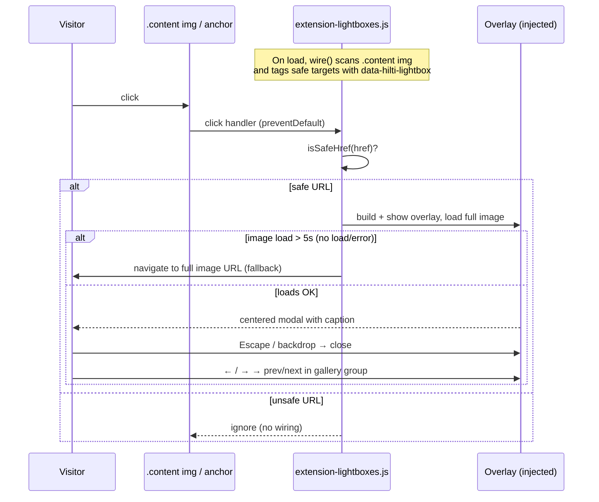

### Files

| File | Content |
|---|---|
| `assets/extension-lightboxes.js` / `.min.js` | Native lightbox IIFE |
| `templates/footer.hbs` | `defer` loads `.min.js` when `enable_lightboxes` is on |
| `templates/document_head.hbs` | Page-loader guard for `data-hilti-lightbox` |
| `manifest.json` | `enable_lightboxes` setting |

---

<!-- CONFLUENCE PAGE: 28. Security: Subresource Integrity (SRI) on CDN Assets -->

## 28. Security: Subresource Integrity (SRI) on CDN Assets

> 🆕 Added in the perf/security hardening round.

### What it does

Every externally-loaded `<script>` and `<link>` (anything not served from the Zendesk Help Center origin) now carries an `integrity="sha384-..."` hash plus `crossorigin="anonymous"`. The browser verifies each file against its hash **before executing it** — a tampered or swapped CDN file simply won't run.

### Why it matters

Without SRI, a compromised CDN edge node could serve malicious JavaScript that runs with full page privileges (supply-chain attack). SRI makes CDN content tamper-evident and fail-closed.

### What is covered

| Resource | Where | Loaded when |
|---|---|---|
| Font Awesome 6.4.0 CSS | `document_head.hbs` | always |
| Alpine.js 3.13.0 JS | `footer.hbs` | always (`defer`) |
| Fancybox 3.5.7 CSS/JS | head + footer | `promoted_video_ids` set |
| Swiper 7.0.9 CSS/JS | head + footer | `promoted_video_ids` set |
| jQuery 3.6.0 JS | `footer.hbs` | `promoted_video_ids` set |
| Plyr 3.6.4 JS | `footer.hbs` | `enable_video_player` set |

### Key implementation decisions

- **Bundle split:** the former jsDelivr `/combine/` bundle did not support per-resource SRI, so it was split into **individual `<script>` tags, each with its own hash**, with the original load order preserved (Alpine → jQuery → Fancybox → Plyr → Swiper) and `defer` on each.
- **Content-addressable paths:** resources moved to npm-based jsDelivr paths (`/npm/pkg@version/...`) rather than GitHub raw paths, so the hash stays valid across CDN edge nodes.
- **Conditional resources still hashed:** when a Handlebars guard (e.g. `promoted_video_ids`) renders a CDN tag, that tag always includes `integrity` + `crossorigin`.

### SRI verification flow

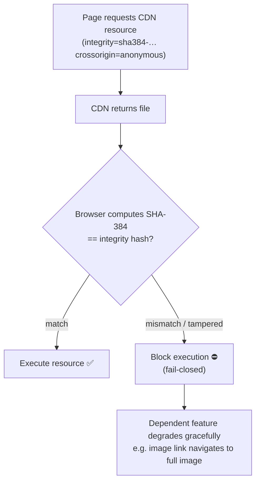

### ⚠️ Maintenance rule: upgrading a CDN version

When you bump a CDN dependency version, the old integrity hash will **no longer match** and the browser will block the file. You MUST regenerate the hash:

```bash
# Compute SHA-384 SRI hash for the exact file at the new version URL
curl -s https://cdn.jsdelivr.net/npm/alpinejs@3.13.0/dist/cdn.min.js \
  | openssl dgst -sha384 -binary \
  | openssl base64 -A
# → paste result as integrity="sha384-<result>"
```

Then update both the URL and the `integrity` value in `document_head.hbs` and/or `footer.hbs`.

### Files

- `templates/document_head.hbs` (Font Awesome, conditional Fancybox/Swiper CSS)
- `templates/footer.hbs` (Alpine, conditional jQuery/Fancybox/Plyr/Swiper JS)

---

<!-- CONFLUENCE PAGE: 29. Performance Hardening -->

## 29. Performance Hardening

> 🆕 Added in the perf/security hardening round. Full spec: `.kiro/specs/theme-perf-hardening/`.

Four improvements, each independently verifiable.

### 29.1 rAF-throttled autocomplete positioning

**Problem:** scroll/resize fired `positionPanel()` on every event, each call reading `getBoundingClientRect()` — forced synchronous layout (layout thrash) and visible jank.

**Fix:** scroll/resize now schedule a single `positionPanel()` per animation frame via `requestAnimationFrame`.

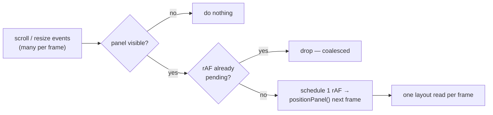

- At most one layout read per frame (~30 calls per 500 ms at 60 fps vs. hundreds before).
- Panel stays within 1px of the input's left edge.
- Pending rAF is **cancelled** when the panel hides (`cancelAnimationFrame`).
- Falls back to a direct call if `requestAnimationFrame` is unavailable (no exception).
- Code: `script.js` around `positionPanel()` / `state.rafId`.

### 29.2 jQuery removed from the critical path

- jQuery is **gone from `<head>`** — no longer render-blocking.
- It loads `defer` in the footer **only** when `promoted_video_ids` is set (its one remaining consumer).
- If lightboxes are off and no promoted videos are configured, **no jQuery or lightbox library ships at all**.

### 29.3 Reduced `!important` usage

- **Non-utility** `!important` declarations reduced to **fewer than 20** (overrides now rely on selector specificity + source order).
- Responsive display utilities (`.hidden`, `.block`, `.flex`, breakpoint variants) keep `!important` by design — that is excluded from the count.
- Any retained `!important` carries a CSS comment naming the external style it overrides (e.g. a Zendesk runtime inline style).
- Custom theme rules are placed **after** `@import`, CDN stylesheets, and Zendesk Copenhagen base styles so the cascade does the work.

> Note: a raw `grep -c '!important' style.css` counts ~100 because it includes the intentional display-utility classes. The <20 target is specifically **non-utility** declarations.

### 29.4 Native lightbox (dependency weight)

Covered in [§27](#27-feature-native-image-lightbox-no-jquery) — replacing Fancybox/jQuery removed the single largest render-blocking dependency.

---

<!-- CONFLUENCE PAGE: 30. Feature: Page Load Indicator (Spinner + Progress Bar) -->

## 30. Feature: Page Load Indicator (Spinner + Progress Bar)

> 🆕 Consolidated and hardened in the recent round (was previously two separate scripts; the "stuck loader" bug is fixed).

### What it does

Two visuals signal page loading, driven by a **single** consolidated script in `document_head.hbs`:

1. **Full-screen spinner** (`hilti-page-loader`) — 4 slanted Hilti-palette bars blinking in sequence.
2. **Top progress bar** (`hilti-page-loading-bar`) — a 3px red bar that animates to 85% then fills to 100% on load.

Both appear on first load and on internal link navigation.

### How it works

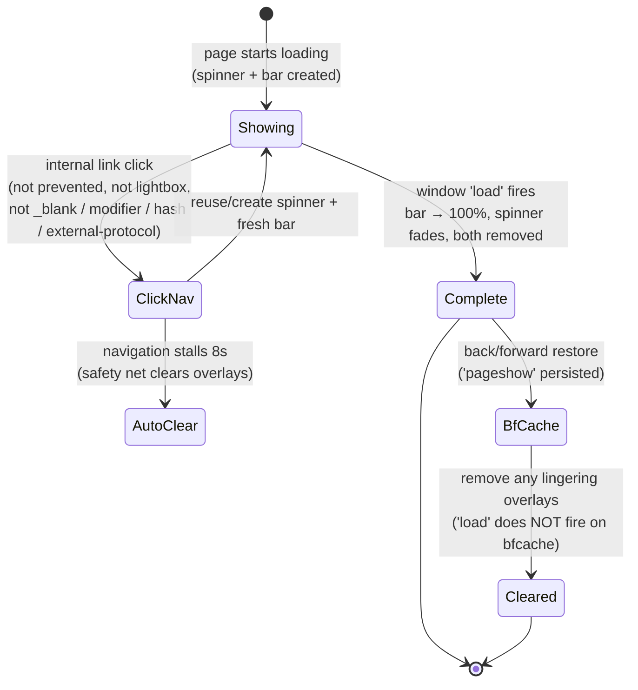

### Why it was hardened (bugs fixed)

| Bug | Fix |
|---|---|
| Loader stuck forever after opening the image lightbox | Click handler skips `e.defaultPrevented` and `data-hilti-lightbox` links (lightbox opens via `preventDefault()`, so no page `load` ever fires) |
| Loader stuck on back/forward navigation | `pageshow` (`persisted`) handler removes lingering overlays — `load` does not fire on bfcache restore |
| Loader stuck on `mailto:` / `tel:` and other OS-handoff links | Click handler skips `mailto:`, `tel:`, `sms:`, `callto:`, `facetime:`, `skype:` |
| Two scripts each registering their own document click listener | Merged into one IIFE with a single click listener |
| Navigation blocked/cancelled → permanent spinner | 8-second safety-net timeout force-clears overlays |

### Excluded from triggering the loader

Hash links · `javascript:` links · `target="_blank"` · modifier-key clicks (Ctrl/Cmd/Shift) · external-protocol links · `data-hilti-lightbox` links · any click where `defaultPrevented` is true.

### Files

- `templates/document_head.hbs` (inline `<style>` + consolidated IIFE)
- `style.css` (fallback rules)

---

<!-- CONFLUENCE PAGE: 31. Figma Visual Alignment -->

## 31. Figma Visual Alignment

> 🆕 Visual polish round aligning the live theme to the Figma design spec.

### What changed

| Area | Change |
|---|---|
| Content column | Header, body, and footer aligned to the **Figma 1520px content column** so all three share one consistent max-width/edge |
| Home page edges | Home sections aligned to the same left/right edges (no mismatched gutters) |
| Title spacing | Standardized **16px gap** below section/category titles |
| Section columns | Category/section grids use consistent column counts matching the design |
| Search highlight | Matched search terms rendered **red + bold with a yellow highlight** background (`<mark>` styling) for scannability |
| Lightbox styling | Centered white modal styled to match the language-selector modal (see [§27](#27-feature-native-image-lightbox-no-jquery)) |

### Search term highlighting

Search results and autocomplete wrap matched query terms in `<mark>` elements. CSS (`style.css`, `mark { ... }` and `.hc-autocomplete-mark`) renders them red-bold on a yellow background. This is purely presentational — the match logic lives in the Search Results and Autocomplete features ([§14](#14-feature-custom-autocomplete-search), [§20](#20-feature-search-results-page)).

### Files

- `style.css` (layout widths, `mark` highlight, section columns, title gaps)
- `templates/header.hbs`, `templates/footer.hbs`, `templates/home_page.hbs` (column alignment)

---

<!-- CONFLUENCE PAGE: 32. System Flow Diagrams -->

## 32. System Flow Diagrams

A single-page visual reference for how the major parts connect. Use this as the onboarding "map"; each diagram links back to its detailed section.

### 32.1 Where a change goes (decision map)

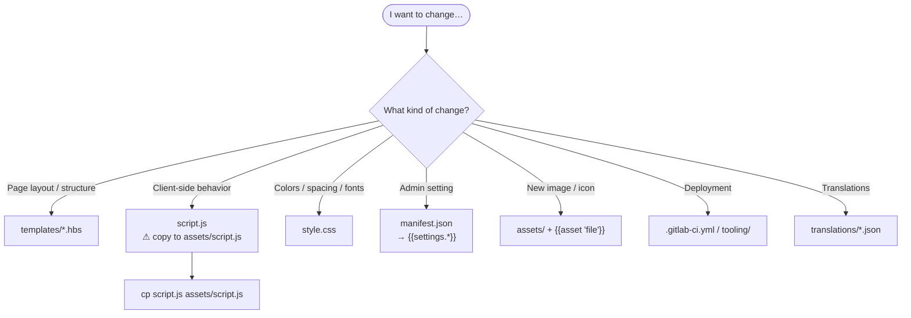

### 32.2 CDN loading & SRI (what loads, when, verified how)

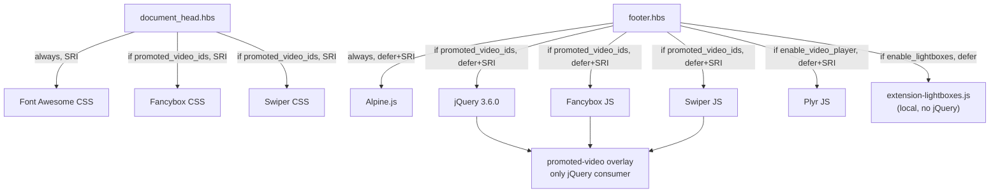

### 32.3 CI/CD pipeline (release → backup → deploy)

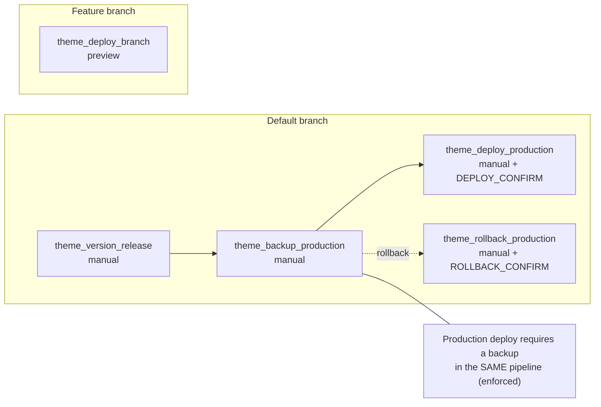

### 32.4 Daily developer workflow

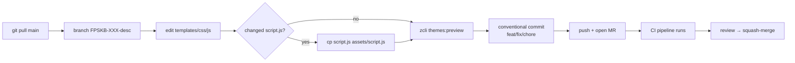

### 32.5 Language selector (article-aware)

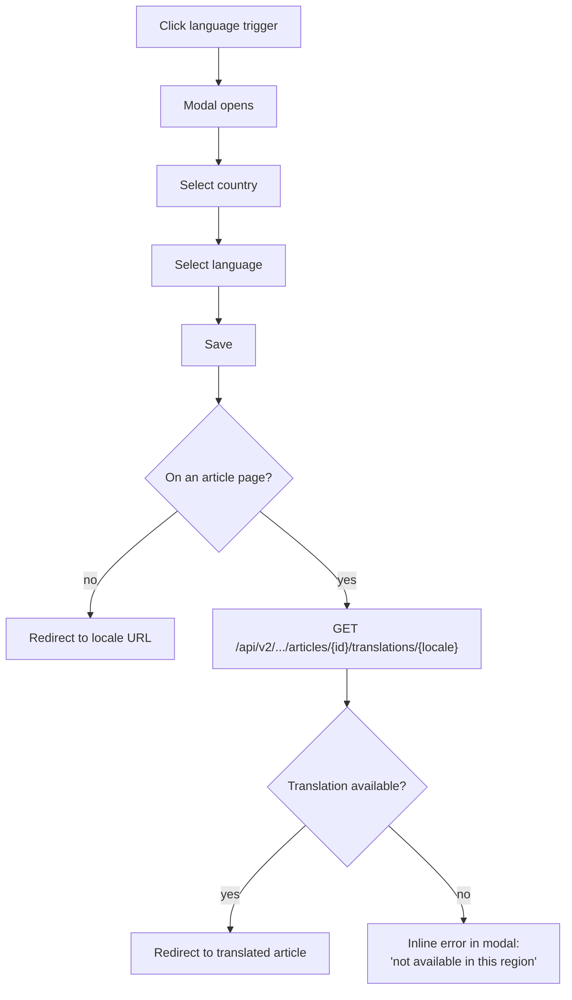

---

## Maintenance Notes

- Update this file whenever theme behavior, settings, scripts, or CI jobs change
- Include documentation updates in the same merge request as feature work
- Each Confluence page section is marked with `<!-- CONFLUENCE PAGE: ... -->` for easy extraction
- **When bumping a CDN dependency, regenerate its SRI hash** — see [§28](#28-security-subresource-integrity-sri-on-cdn-assets)
- **After editing `script.js`, copy it to `assets/script.js`** — Zendesk loads from `assets/`
- Diagrams are Mermaid; keep them in sync with the code they describe

---

*Last updated: 2026-10-07 · Theme version `0.19.69`*
